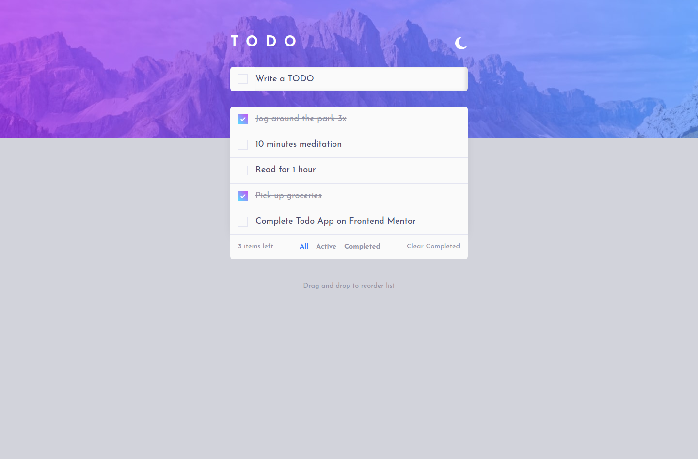
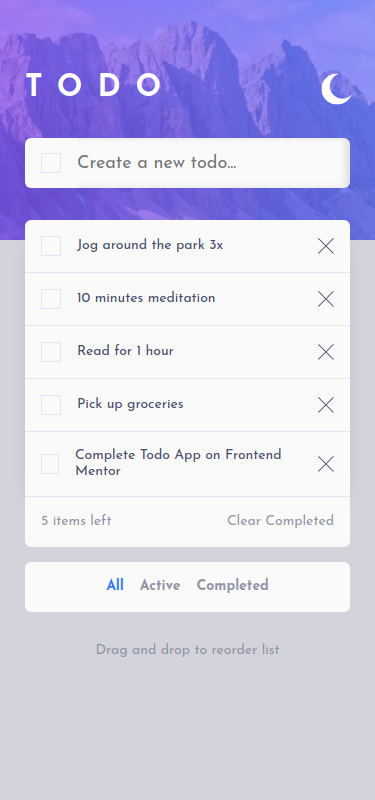
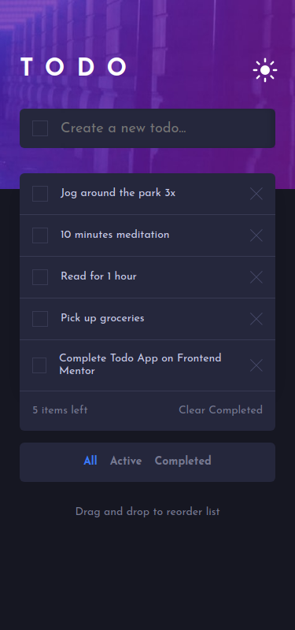

# Frontend Mentor - Todo app solution

This is a solution to the [Todo app challenge on Frontend Mentor](https://www.frontendmentor.io/challenges/todo-app-Su1_KokOW). Frontend Mentor challenges help you improve your coding skills by building realistic projects.

## Table of contents

- [Overview](#overview)
  - [The challenge](#the-challenge)
  - [Screenshot](#screenshot)
  - [Links](#links)
- [My process](#my-process)
  - [Built with](#built-with)
  - [What I learned](#what-i-learned)
  - [Useful resources](#useful-resources)
- [Author](#author)

## Overview

### The challenge

Users should be able to:

- View the optimal layout for the app depending on their device's screen size
- See hover states for all interactive elements on the page
- Add new todos to the list
- Mark todos as complete
- Delete todos from the list
- Filter by all/active/complete todos
- Clear all completed todos
- Toggle light and dark mode
- **Bonus**: Drag and drop to reorder items on the list

### Screenshot

### Links

- Solution URL: [Solution URL here](https://github.com/atorres-io/frontend-mentor-todo-app)
- Live Site URL: [Live site URL here](https://amazing-jepsen-85b532.netlify.app/)

## My process

### Built with

- Library (Sortable.js)
- Drag & Drop
- React.js

### What I learned

The useState control to keep all the information in the app updated with any changes made to a TODO.

### Useful resources

- [Sortable.js](https://sortablejs.github.io/Sortable/) - This helped me for reorderable drag-and-drop lists.

## Author

- Instagram - [@atorres.designs](https://www.instagram.com/atorres.designs/)
- Frontend Mentor - [@atorres-io](https://www.frontendmentor.io/profile/atorres-io)
- Github - [@atorres-io](https://github.com/atorres-io)
- Codepen - [@atorres-designs](https://codepen.io/atorres-designs)
- LinkedIn - [@atorresalcala](https://www.linkedin.com/in/atorresalcala)
